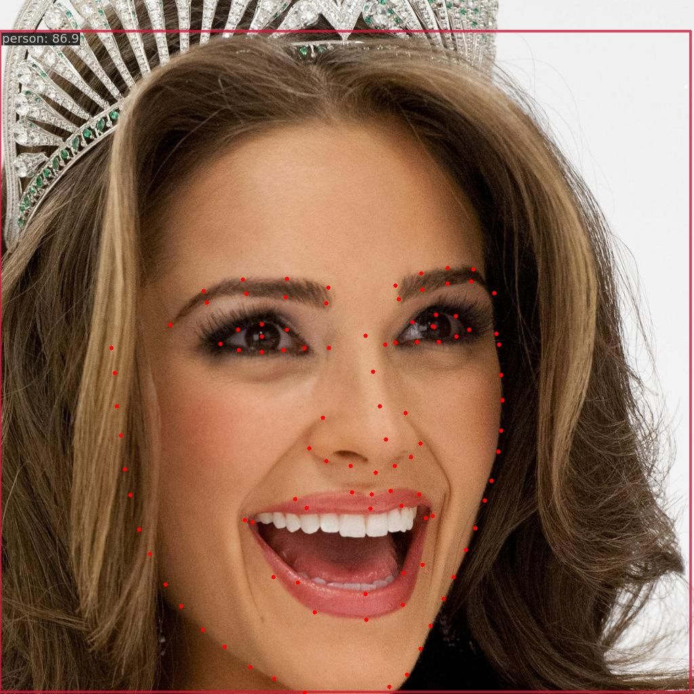

# 人脸识别与特效技术

本仓库包含课程中的人脸数据可视化、人脸检测和人脸关键点定位实现。

## 人脸检测

`mmdet_coco_detection.py` 使用预训练的 MMDetection RTMDet-tiny COCO
模型进行目标检测，并保存带检测框的可视化图片和预测 JSON 文件。

```powershell
python mmdet_coco_detection.py --input "CelebAMask-HQ\CelebAMask-HQ\CelebA-HQ-img" --max-images 100 --output "outputs\mmdet_coco_celeba100" --device cuda:0
```

> COCO 模型是通用目标检测模型，`person` 类别的结果仅用于完成基线检测与
> 可视化，并不是专用的人脸检测结果。


## 人脸关键点定位

`mmpose_face_keypoints.py` 使用预训练的 MMPose 人脸关键点模型，对前一阶段
生成的检测可视化图片进行关键点定位。结果图片和预测 JSON 会保存至
`outputs/mmpose_face_keypoints`。

```powershell
python mmpose_face_keypoints.py --device cuda:0
```



## 测试

```powershell
python -m unittest tests.test_mmdet_coco_detection tests.test_mmpose_face_keypoints
```
