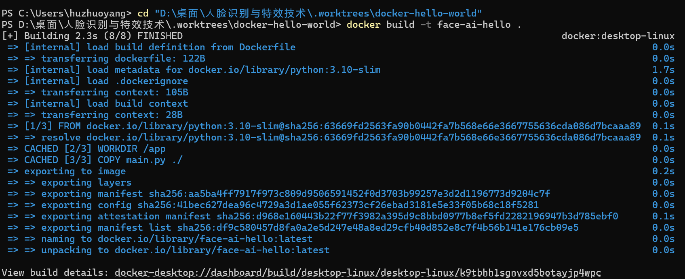
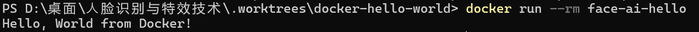

# Docker 你好，世界

## 先获取正确的分支

Docker 相关文件位于 `docker-hello-world` 分支。请先克隆该分支，再进行构建：

```powershell
git clone -b docker-hello-world https://github.com/zh315-bit/face-recognition-and-special-effects-technology.git
cd face-recognition-and-special-effects-technology
```

如果从 GitHub 下载 ZIP 文件，请先在网页上切换到 `docker-hello-world` 分支。默认的 `main` 分支可能不包含 `Dockerfile`。

## 构建并运行

请在包含 `Dockerfile` 的目录中运行以下命令：

```powershell
docker build -t face-ai-hello .
```



运行容器：

```powershell
docker run --rm face-ai-hello
```

预期输出：

```text
Hello, World from Docker!
```


